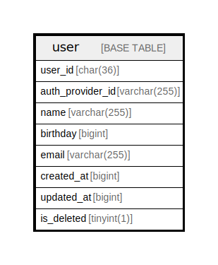

# user

## Description

<details>
<summary><strong>Table Definition</strong></summary>

```sql
CREATE TABLE `user` (
  `user_id` char(36) NOT NULL,
  `auth_provider_id` varchar(255) NOT NULL,
  `name` varchar(255) NOT NULL,
  `birthday` bigint NOT NULL,
  `email` varchar(255) NOT NULL,
  `created_at` bigint NOT NULL,
  `updated_at` bigint NOT NULL,
  `is_deleted` tinyint(1) NOT NULL DEFAULT '0',
  PRIMARY KEY (`user_id`)
) ENGINE=InnoDB DEFAULT CHARSET=utf8mb4 COLLATE=utf8mb4_0900_ai_ci
```

</details>

## Columns

| Name | Type | Default | Nullable | Children | Parents | Comment |
| ---- | ---- | ------- | -------- | -------- | ------- | ------- |
| user_id | char(36) |  | false |  |  |  |
| auth_provider_id | varchar(255) |  | false |  |  |  |
| name | varchar(255) |  | false |  |  |  |
| birthday | bigint |  | false |  |  |  |
| email | varchar(255) |  | false |  |  |  |
| created_at | bigint |  | false |  |  |  |
| updated_at | bigint |  | false |  |  |  |
| is_deleted | tinyint(1) | 0 | false |  |  |  |

## Constraints

| Name | Type | Definition |
| ---- | ---- | ---------- |
| PRIMARY | PRIMARY KEY | PRIMARY KEY (user_id) |

## Indexes

| Name | Definition |
| ---- | ---------- |
| PRIMARY | PRIMARY KEY (user_id) USING BTREE |

## Relations



---

> Generated by [tbls](https://github.com/k1LoW/tbls)
